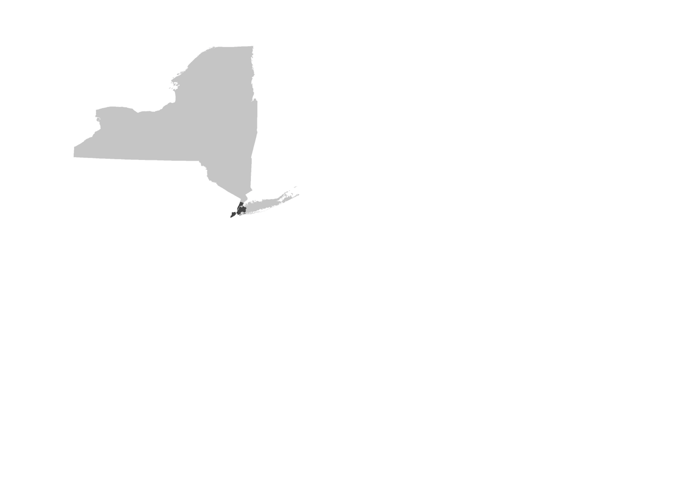

background-size: cover
class: left ,top
# Final Project

## Steps:

--

- ### .inverse[GIS Question - Project Proposal #1 (completed) - Stage 1]

--

- ### .inverse[Develop GIS Methods - Project Methodology #2 (current) - Stage 2]

--

- ### .inverse[Proceed to GIS Analysis]

--

- ### .inverse[Compete Analysis | Derive Quantitative Results | Summarization | Conclusive Findings]

--

- ### .inverse[Prepare & Package Final Presentation | Approximately 15 - 20 Slides | 9 - 10 Minutes]

---

background-size: cover
class: left ,top
# Final Project

### Traditional Layout - GIS Poster Session
 
.center[]
.footnote[[source](https://www.cerf.science/guidelines-for-poster-presentations)]

---

background-size: cover
class: left ,top
# Final Project

### Wayfinding - Presentation Progression
.center[]

---

background-size: cover
class: left ,top
# Final Project

### Wayfinding - Font Selection | Hierarchy
#### ( Droid Sans | Helvetica Neue)
 
.center[]

---

background-size: cover
class: left ,top
# Final Project

### Page Space - Grid Formats
.center[]
.footnote[[source](https://visme.co/blog/layout-design/)]

---

background-size: cover
class: left ,top
# Final Project

### Page Space - Grid Formats
 
.center[]
.footnote[[source](http://printingcode.runemadsen.com/lecture-grid/)]

---

background-size: cover
class: left ,top
# Final Project

### Page Space - Grid Formats
 
.center[]
.footnote[[source](http://printingcode.runemadsen.com/lecture-grid/)]

---

background-size: cover
class: left ,top
# Final Project

### Page Space - Grid Formats
 
.center[]
.footnote[[source](http://printingcode.runemadsen.com/lecture-grid/)]

---

background-size: cover
class: left ,top
# Final Project
### Variable Map Scales - Progression + Emphasis
.center[]

---

background-size: cover
class: left ,top
# Final Project
### Variable Map Scales - Progression + Emphasis
.center[]

---

background-size: cover
class: left ,top
# Final Project
### Variable Map Scales - Progression + Emphasis
.center[]

---

background-size: cover
class: left ,top
# Final Project
### Map Projections
.center[]

---

background-size: cover
class: left ,top
# Final Project
### Sequential Imaging
.center[]

---

background-size: cover
class: left ,top
# Final Project
### Sequential Imaging
.center[]

---

background-size: cover
class: left ,top
# Final Project
### Quantification & Summarization - Small Multiples	
.center[]
.footnote[[source](https://www.axios.com/where-the-us-is-bombing-isis-in-iraq-and-syria-9187d0a9-edea-4d4a-8a36-628636e7f752.html)]

---

background-size: cover
class: left ,top
# Final Project
### Quantification & Summarization - Charts + Plots	
.center[]
.footnote[[source](https://interworks.com/blog/ccapitula/2014/08/04/tableau-essentials-chart-types-introduction/)]

---

background-image: url(img/1.png)
background-size: cover
class: left ,top, inverse
# Lecture 13 - Final Project - End

